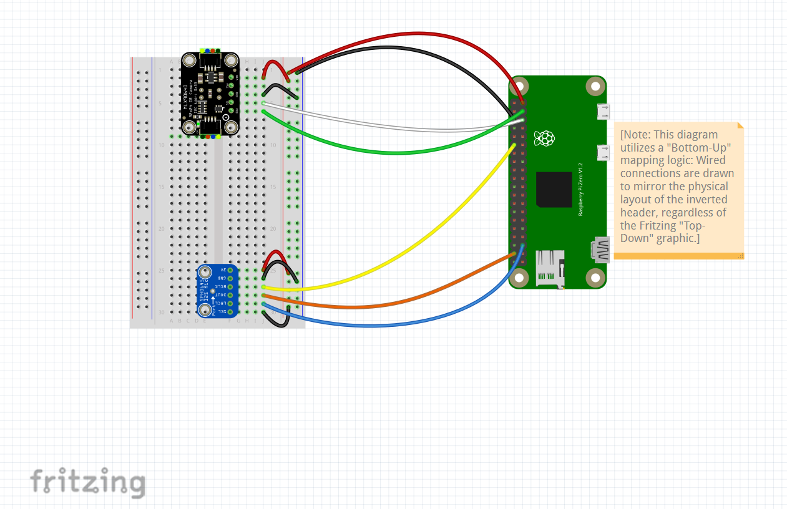

# Week 1: 3/30/26 - 4/5/2026 (12 hours)
## Market Research & Procurement:
* Researched lightest Raspberry Pi model for project 
* Researched  acoustic and thermal sensor compatibility for Raspberry Pi Zero 2 W
* Selected UGREEN reader for micro SD card
* Finalized Bill of Materials
## Environment Setup:
* Brains: Raspberry Pi Zero 2 W - small and cheap but powerful enough to run code 
* Setting up the micro SD with Raspberry Pi Imager --> Used Raspberry Pi Lite, setup username, password, and custom settings
* First power-up: Plugged in the Raspberry Pi Zero 2 and watched the green light as it stretches its files to fit the whole SD card and looks for my laptop on the network
* Handshake: Successfully "talked" to the Pi from my laptop using SSH. Password worked, and it is up and running.
* Inventory & Pin Mapping: Checked the 2 x 20 header to plan where the acoustic and thermal sensors will eventually plug in once it is time to solder.

## Infrastructure & Physical Hardening
* Performed "digital unlocking" via sudo `raspi-config` (control panel)
  * Enabled SPI for acoustic data flow.
  * Enabled I2C interface for thermal sensing. 
* Physical hardening on Pi Zero 2 W:
  * Installed M2.5 6+6mm nylon standoffs (feet)
  * Added M2.5 nylon washers to help with acoustic isolation/vibration dampening
  * Secured feet with M2.5 nylon hex nuts
* System is "Hardware Hardened" and ready for Phase 2 (soldering/sensors)

## Documentation and DevOps
* Setting up GitHub repository
* Creating and writing the LOG.md and README.md files
* Configured SSH alias 'echo' on ThinkPad X1 Carbon  for faster startups

# Week 2: 4/6/2026 - 4/12/2026 (20 hours)
## Hardware Development: Phase 1
*  **GPIO Header Installation & Validation**
  * Through-hole solder of the 2 x 20 male pin header to the Raspberry Pi Zero 2 W board
  * Duration: ~ 2.5 Hours (including joint rework and thermal management)
  * Rework:
    * Corrected pin wetting issues using a solder pump, additional flux coverage, and reflowing the joints
    * Eliminated bridges
   * Visual inspection of the soldered joints
   * Validation via SSH session:
     * Verified baseline temperature between 42.3°C and 43.2°C when Pi board is powered on
     * Loopback Test: Created a manual bridge between  header Physical Pin 1 and Physical Pin 11 (GPIO 17) using a F-M jumper wire using bash command `watch -n 0.1 pinctrl get 17`
     * Observed logic state change from `lo` to `hi` upon contact with the male end of the jumper wire
     * Confirmed the soldered joins for the power rail and the I/O pins are sound and the software is successfully interfacing with the hardware.
## **Sensor Preparation**: Phase 2
  * Acoustic Sensor (Microphone): Soldered a 6-pin header to the sensor's breakout board
    * Performed a visual check for bridges and improper wetting, and reworked if needed
  * Thermal Camera Sensor:  Modified the given 6-pin header to a 5-pin header
    * Removed a header pin from the end and used flush cutters to remove the plastic housing form the header
    * Modification allowed for the header to be matched and soldered to the 5-hole footprint of the camera's breakout board
    *Performed a visual check for bridges and improper wetting, and reworked if needed   
## **Hardware Wiring**: Phase 3
  * Color-to-pin mapping
    * RED: Power in (3.3V)
      * Red rail (+) to physical Pi Pin #1
      * Red rail (+) to breadboard 2A (IR Camera)
      * Red rail (+) to breadboard 25A (Microphone)  
  * BLACK: Grounding (GND) wires
      * Blue rail (-) to physical Pi Pin #6
      * Blue rail (-) to breadboard 4A (IR Camera)
      * Blue rail (-) to breadboard 26 (Microphone)     
  * ORANGE: Data Out (Microphone)
    * DOUT in Microphone to physical Pi Pin #38 from breadboard 28A
  * GREEN: Data Out (IR Camera)
    * SDA in IR Thermal Camera to physical Pi Pin #3 from breadboard 6A
  * YELLOW: Clock (bit clock)
    * BCLK in Microphone to physical Pin #12 from breadboard 27A
  * WHITE: Clock (IR Camera)
    * SCL in IR Thermal Camera to physical Pi Pin #5 to breadboard 5A
  * BLUE: Switch (Microphone)
    * LRCL (Select) in Microphone to physical Pi Pin #35 from breadboard 29A
  * BLACK (TEMP): SEL (NOTE: change to brown/purple with future supplies to avoid confusion between GND and SEL)
## Hardware-Software Integration & Validation: Phase 4
* **I2S Microphone Implementation**
  *Protocol Configuration: In order to enable the Pi to act as the I2S clock master,  `/boot/firmware/config.txt` needed to be modified to include the `googlevoicehat-soundcard` overlay
  *Validation: Captured 32-bit audio  at 48kHz via `arecord`
* **I2C IR Camera Integration**
  *Bus Management: Activated I2C and started a bus scan to identify the specific sensor at address 0x33
  *Configuration: Installed `python3-smbus`, `i2c-tools`, and `--break-system-packages` flags (to bypass the Pi's safety lock)
  * Real-Time Testing: Used a basic matrix script to confirm a 24 x 32 thermal grid response to heat (hand waving in front of camera lens)

# Week 3: (4/13/2026 - 4/19/2026) (18 hours)
 
## Hardware Wiring Schematic
 * Hardware Visualization Planning
   * Researched different options for creating hardware wiring schematics that are easy to follow and semi-realistics
   * Learned the basics of how to use Fritzing software
     * Imported Adafruit sensor parts to the file using Fritzing Parts GitHub repository
     * Mentally mapped out the Bottom-Up header placement on the header of the Pi
     * Used Fritzing software to map out and construct a schematic for wiring between the Raspberry Pi Zero 2 W and the acoustic and thermal sensors

### Hardware Schematic

## Relational Database Mapping
* ER Diagram Development:
  * Brainstormed entities and attributes (PK, FK, etc) for ER Diagram
  * Used normalization to organize data and reduce redundancy
  * Researched how to create a schema visual using Mermaid 
  * Schema Draft Location: (insert link here for initial_mapping.md) 

 ## Documentation and Version Control
 * Established directory, `/hardware_schematics`, for prototyping visualization
 * Established directory, `/database_schema` for ER Diagrams and initial mapping of entities and attributes

# Week 4: (4/21/2026 - 4/26/2026) (18 hours)
## Database Construction

**Schema Implementation:**
* Translated the ER Diagram into a working SQLite database (`echovolt.db`)

* Established relational hierarchy: `assets` (Server Racks) --> `nodes` (Pi Units) --> `readings` (Sensor Data).

* Created a setup script, `db_manager.py`, that builds the entire database from scratch. This will allow me to have access on any device.   
* Organized the DB into 3 layers:
    * Server Racks
    * Pi Units (Nodes)
    * Live Readings
* Implemented initial CREATE functions using  `commit()` to prevent data loss

# Week 5: 4/27/2026 - 5/3/2026 (22 Hours)
**Triage Logic**

* Thermal Safety: Researched server rack tolerances to find that, in general, ambient air above 45°C is industry standard for "Critical" intervention to prevent throttling

* Acoustic Ranges: Researched fan motor failure frequencies
    * Vibration anomalies and "screaming" bearings often manifest as high-frequency spikes

* Developed the waterfall logic:
    * Multi-sensor triage system that analyzes temperature and frequency
    * Edge case filtering: catches "insane" data like frequency spikes over 20,000Hz so a sensor glitch doesn't trigger a false alarm
    *Status Thresholds: Defined the boundaries for NORMAL, WARNING, and CRITICAL statuses based on research of data center safety standards.
 
# Week 6: 5/4/2026 - 5/10/2026 (28 Hours)
## Reporting & Demo UI

**Verification & System Hardening**
  * Modified `check_db.py` to produce a better formatted, human-readable terminal reports.
  * Added unit conversion from raw data into °C and Hz to make the dashboard more intuitive for end-users.
* Thermal Imaging Pipeline Troubleshooting
  *  Over 12 hours of time was used on  raw data capture optimization from the thermal sensor (MLX90640).
  *  Encountered significant SSH terminal freezing and latency when trying to incorporate continuous, high-density array frames directly from the Pi Zero 2 W architecture.
    *  Brainstormed and pivoted to using real-time text-matrix delta streams instead of colorized image rendering/snapshots (will do actual code logic during week 7).

**System Stress Testing**
* Created and executed multiple test scenarios to verify that the database correctly logs the priority of the various failure modes.
* Verified that the automated priority logs are triaging correctly and logging failures

# Week 7: 5/11/2026 - 5/17/2026 (22 Hours)
**Network Setup & Thermal Matrix Code Implementation**

* Text-matrix Code Logic & Implementation:
    * Developed and tested Python code logic to replace the previous bicubic image processing with real-time text-matrix array.
    * Mapped sensor temperature ranges to specific terminal characters, configuring script to print lightweight grids of ASCII symbols based on data-stream deltas
    * Confirmed this code shift reduced CPU usage, allowing Pi to stream live thermal updates without over-loading its processor.
      
* Switching to Lightweight Terminal Tools:
  * Discovered that heavy graphical extensions like VS Code Remote SSH were adding to the lag during live matrix testing.
  * Removed the heavy IDE background processes and switched to direct, lightweight terminal windows via raw SSH sessions.
  * Used standard command-line `scp` (secure copy) to manually push code updates from my Windows laptop (`satte@KARMAisMyAura`) over the network to the Pi (`brosat@echovolt-pi`) to ensure a fast, lag-free testing environment.
    
* Overriding Linux Security Blocks for Sensor Packages:
  * Encountered a modern Linux OS safety block (`externally-managed-environment` error) while attempting to install the Python audio packages on the Pi.
  * Researched the new OS-level rules (PEP 668) that prevents users from installing unmanaged code that might conflict with core system files.
  * Used targeted `--break-system-packages` flag to safely override the OS lock so that `sounddevice` and `numpy` could deploy for the upcoming microphone integration.

# Week 8: 5/18/2026 - 5/24/2026 (18 hours)
**Edge Node Finesse and Audio Troubleshooting**

* Permanent Text-Matrix Integration:
  * Permanently integrated the lightweight text-matrix code into the main edge-node monitoring loop.
  * Established baseline triage logic: Pi loops the ASCII text matrix for contstant monitoring.
  * Configured the system to save heavy colorized image rendering/snapshots strictly for triggered alerts if an asset breaches a threshold.
  * UI Optimization Breakthrough: Integrated raw ANSI color escape codes directly into Python terminal print strings.
    * Allows text matrix to display live thermal gradients dynamically directly in the CLI without adding any significant CPU load.

* Microphone Troubleshooting & Indexing:
  * Investigated an issue where Python audio scripts would hang or crash in the background due to hardware registration conflicts on the headless Pi.
  * Audited system audio devices using index commands (`python -m sounddevice`) to map the exact hardware card IDs.
  * Located the correct index for the physical I2S microphone breakout board and updated the code configuration to target it directly.
  * Resolved script hanging and now displays continuous acoustic monitoring without crashing.

# Week 9: 5/25/2026 - 5/31/2026 (15 Hours)
* Production Hardening, Visual Flow Optimization, & Learning Foundation:
  * Refactoring Loop Nesting & Timing Synchronization
    * Diagnosed an infinite blocking bug during runtime integration where the script compiles but wouldn't stream.
      * Traced issue back to a nested scope indentation error that trapped the  execution inside the acoustic hardware polling step (blocked the rendering matrix display)
    * Fixed Audio Timing Freeze:
      * Corrected a bug where the microphone readout would freeze flat at 1.00 Hz.  Diagnosed a timing conflict: adding a manual 0.5 sec pause at the bottom of the code forced the main loop to run slower than the microphone's natural 1.0 sec recording schedule. This timing  mismatch caused the audio system to lag behind and return blank data. Removing the sleep delay allowed the code loop to sync with the microphone's hardware clock.
    * Resolved terminal "waterfall scrolling" by using a multi-stage terminal flush sequence (`\033[2J\033[3J\033[H`) to clear the frame history  and lock the display grid in place.

* UI Palette & Character Fine-Tuning:
  *  Redesigned the visual thermal gradient to closer match industrial UI standards, so the sequence of transition from cold to hottest is now Blue -> Cyan -> Purple -> Yellow -> Orange -> Red.
  * Certain symbols and variations of colors for the thermal grid design were also modified to be more easily seen.   

* Frequency Learning Logic Initiated
  *Formulated the software architecture for the acoustic learning phase to process the raw output of the verified VoiceHAT Fast Fourier Transform (FFT) pipeline.

*Demonstration Preparation & Video Production:
* Created a mock test sequence script to demonstrate the Intelligent Frequency Evaluation Engine's response to transient vs sustained anomalies.

# Week 10: 6/1/2026 - 6/5/2026 (14 hours)
* Finished main dashboard:
  * Built a live terminal screen that prints out colorful thermal matrix, acoustic frequency speed, and the peak temperature all in one view.
  * Added --help command to print out an emergency support card with contact information, manager phone numbers, and the length of time for maintenance rotation schedule.
  * Fixed a database constraint lock by adding missing nodes parent table and code to pre-seed it with node_id = 1 before the main loop starts.  This is useful because it stops the database from blocking the sensor data logs and ensures everything saves successfully every second.
  * Added an "All Clear" Counter to show how long the system has been running smoothly without any hiccups
  * Added Node Health Badges (OK vs FAIL) easily displayed at-a-glance
  * Added "Rate of Change" Heat Warning which flags thermal spike trends early (allows for intervention before a critical alert is triggered)
* Confirmed need to expand UI from CLI to web-based site.  CLI works great for testing, but it makes it difficult to look back at older data easily (for trends).
  

  # Future Project Goals:
  * Next iteration prototyping for edge node
    * Custom length for wires, solder all connections from Pi to Adafruit Perma Proto Bonnet Mini (designed specifically for Pi zero footprint)
    * Create a prototype for an enclosure for the node (keep debris out) but allow mic and thermal camera to work without obstruction
    * 3D printing a case for this prototype
    * Extensive testing of mic and thermal camera in different industrial environments
 
